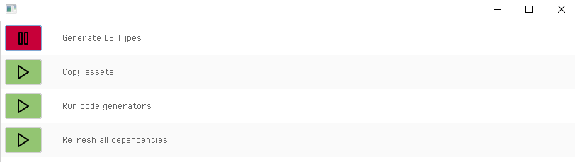

# hxdashboard

GUI for running Haxe ops tasks on local. Runs on Heaps and HaxeUI.

This is less of a library and more of a standalone application. Clone the repo, add your processes and build.

I didn't really want to make this, but I was constantly having a need for this sort of application and could find no simpler alternatives. Right now it's just an easily configurable set of run buttons, but stuff like progress bars and error coloring would be pretty trivial to implement. I'll add additional features as the need arises. Feel free to raise PRs or fork or just use this as inspiration for a better application.

## Usage

```
class Main {
    public static function main() {
        new HxDashboard([
            HxDashboardUtils.createCMDProcess("Run cmd process", "hl command.hl"),
            getCustomProcess(),
            ...
        ]);
    }

    public static function getCustomProcess(): HxDashboardProcess {
        return Process("Run custom process", 
        () -> { //on start
            var payload = {data: startAsyncWork()}; //any type
            return payload;
        }, 
        (payload, op) -> { //all behaviors in one callback as requested by op arg
            switch op {
                case OnFrame(dt): {
                    if(payload.data.isDone()){
                        return Complete;
                    }
                    return WaitNextFrame;
                }
                case Kill: {
                    payload.data.kill();
                    return Killed;
                }
            }
        });
    }
}
```

